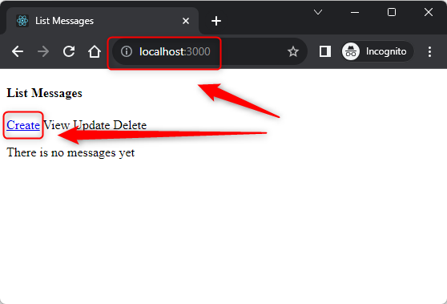
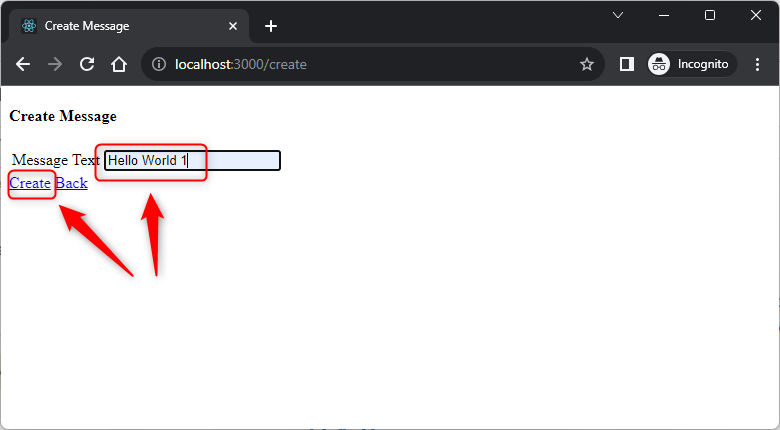
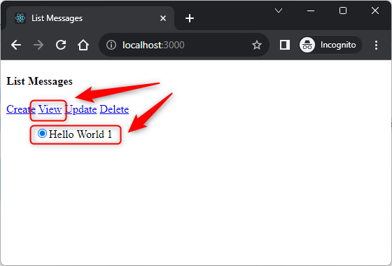
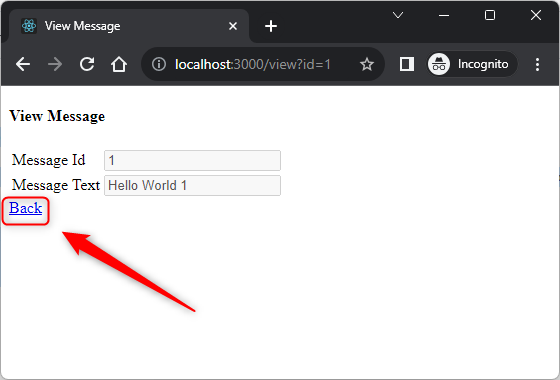
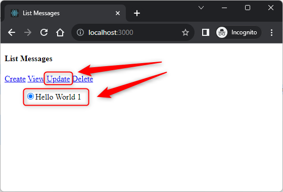
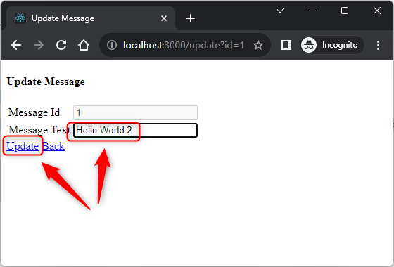
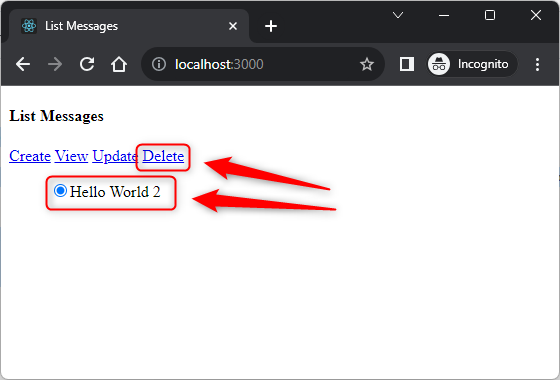
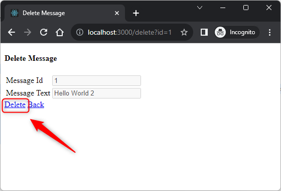
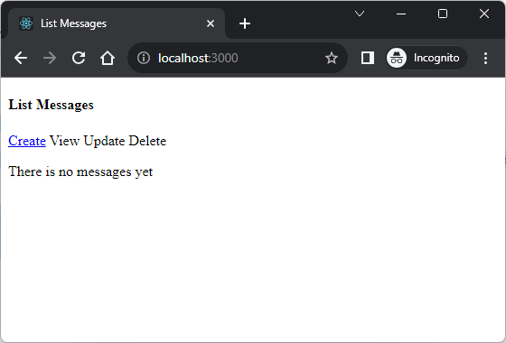

USAGE COMMANDS
--------------

> Please be aware that following tools should be installed in advance on your computer: **node.js**. 

> Please **clone/download** project, open **project's main folder** in your favorite **command line tool** and then **proceed with steps below**. 

Usage steps:
1. (Optional) In a command line create react application with `npx create-react-app js-react-gui-html-helloworld-crud`
1. In a command line tool install nmp packages with `npm install`
1. In a command line tool start application with `npm start`
1. In a html browser (e.g. Chrome) visit `http://localhost:3000`
   * Expected **List Messages** page with empty list
1. In a html browser (e.g. Chrome) on **List Messages** page click `Create` link
   * Expected **Create Message** page
1. In a html browser (e.g. Chrome) on **Create Message** page fill **Message Text** as "Hello World 1" and click `Create` link
   * Expected **List Messages** page with one item
1. In a html browser (e.g. Chrome) on **List Messages** page check item and click `View` link
   * Expected **View Message** page with message data
1. In a html browser (e.g. Chrome) on **View Message** page click `Back` link
   * Expected **List Messages** page with one item
1. In a html browser (e.g. Chrome) on **List Messages** page check item and click `Update` link
   * Expected **Update Message** page with message data
1. In a html browser (e.g. Chrome) on **Update Message** page fill **Message Text** as "Hello World 2" and click `Update` link
   * Expected **List Messages** page with updated item  
1. In a html browser (e.g. Chrome) on **List Messages** page check item and click `Delete` link
   * Expected **Delete Message** page with message data
1. In a html browser (e.g. Chrome) on **Delete Message** page click `Delete` link
   * Expected **Confirmation** dialog
1. In a html browser (e.g. Chrome) on **Confirmation** dialog click `Ok` button
   * Expected **List Messages** page with empty list
1. Clean up environment 
     * In a command line tool stop application with `ctrl + C`

USAGE IMAGES
------------

DESCRIPTION
-----------

##### Goal
The goal of this project is to present how to implement **CRUD** (Create, Read, Update, Delete) operations in an application type **GUI HTML** in **JavaScript** programming language with usage **react** framework. This application enables adding, reading, updating and deleting messages.

##### Terminology
Terminology explanation:
* **JavaScript**: is a scripting or programming language that allows you to implement complex features on web pages or to implement web applications.
* **GUI HTML**: it's an abbreviation for Graphical User Interface. It enables user to interact with application. GUI HTML means that user interacts with application via html web pag.
* **React framework**: It’s used for building interactive user interfaces and web applications quickly and efficiently with significantly less code than you would with vanilla JavaScript.

##### Flow
The following flow takes place in this project:
1. User via any html browser sends request to application with specific CRUD action: Create, Read, Update or Delete.
1. Application performs specific CRUD action.
1. Application sends back response to user via html browser with page. This page is different and depends on specific CRUD action.

##### Launch
To launch this application please make sure that the **Preconditions** are met and then follow instructions from **Usage** section.

##### Technologies
This project uses following technologies:
* **JavaScript**: `https://docs.google.com/document/d/1wtk8TTIDLsHSvtyUp7uCk-pOKTpmNwMANRGmBNaoBpc/edit?usp=sharing`
* **Node** (section 'Node'): `https://docs.google.com/document/d/1wtk8TTIDLsHSvtyUp7uCk-pOKTpmNwMANRGmBNaoBpc/edit?usp=sharing`
* **React framework** (section 'React Framework'): `https://docs.google.com/document/d/1wtk8TTIDLsHSvtyUp7uCk-pOKTpmNwMANRGmBNaoBpc/edit?usp=sharing`

PRECONDITIONS
-------------

##### Preconditions - Tools
* Installed **Operating System** (tested on Windows 11)
* Installed **Node** (tested on version 18.18.1)

##### Preconditions - Actions
* Download **Source Code** (using Git or in any other way) 
* Open any **Command Line** tool (for instance "Windonw PowerShell" on Windows OS) on downloaded **project's main folder**