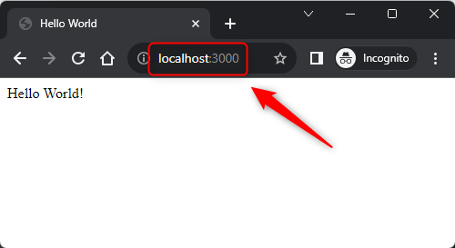

USAGE COMMANDS
--------------

> Please be aware that following tools should be installed on your local PC: **Docker**. Docker tool has to be **up and running**.

> Please **clone/download** project, open **project's main folder** in your favorite **command line tool** and then **proceed with steps below**. 

Usage steps:
1. In a command line tool build Docker image with `docker build -t js-react-gui-html-helloworld-docker-single-image .`
1. In a command line tool start Docker container with `docker run -d -p 3000:3000 --name js-react-gui-html-helloworld-docker-single-container js-react-gui-html-helloworld-docker-single-image`
1. In a html browser (e.g. Chrome) and visit `http://localhost:3000`
   * Expected **Hello World** page
1. (Optional) In a command line tool check list of all images with `docker images`
   * Expected **list of all docker images** downloaded on a computer
1. (Optional) In a command line tool check list of all containers with `docker ps -a`
   * Expected **list of all docker containers** installed on a computer
1. (Optional) In a command line tool check application logs with `docker logs js-react-gui-html-helloworld-docker-single-container`
   * Expected **application logs**
1. Clean up environment 
     * In a command line tool stop and remove Docker container with `docker rm -f js-react-gui-html-helloworld-docker-single-container`
     * In a command line tool stop and remove Docker image with `docker rmi js-react-gui-html-helloworld-docker-single-image`

USAGE IMAGES
------------

DESCRIPTION
-----------

##### Goal
The goal of this project is to present how to **dockerize** an application type **GUI HTML** in **JavaScript** programming language with usage **react** framework. Dockerize means that application is installed on Docker instead directly on computer.

##### Terminology
Terminology explanation:
* **JavaScript**: is a scripting or programming language that allows you to implement complex features on web pages or to implement web applications.
* **GUI HTML**: it's an abbreviation for Graphical User Interface. It enables user to interact with application. GUI HTML means that user interacts with application via html web pag.
* **React framework**: It’s used for building interactive user interfaces and web applications quickly and efficiently with significantly less code than you would with vanilla JavaScript.
* **Docker**: this tool enables separating applications from computer. It means that instead installing application directly on computer we install them on Docker. In this way we can easly add, remove and modify any application without changing our computer system.

##### Flow
The following flow takes place in this project:
1. User via any html browser sends request to application for the content.
1. Application sends back response to user via html browser with message

##### Launch
To launch this application please make sure that the **Preconditions** are met and then follow instructions from **Usage** section.

##### Technologies
This project uses following technologies:
* **JavaScript**: `https://docs.google.com/document/d/1wtk8TTIDLsHSvtyUp7uCk-pOKTpmNwMANRGmBNaoBpc/edit?usp=sharing`
* **Node** (section 'Node'): `https://docs.google.com/document/d/1wtk8TTIDLsHSvtyUp7uCk-pOKTpmNwMANRGmBNaoBpc/edit?usp=sharing`
* **Npm** (section 'Npm'): `https://docs.google.com/document/d/1wtk8TTIDLsHSvtyUp7uCk-pOKTpmNwMANRGmBNaoBpc/edit?usp=sharing`
* **React framework** (section 'React Framework'): `https://docs.google.com/document/d/1wtk8TTIDLsHSvtyUp7uCk-pOKTpmNwMANRGmBNaoBpc/edit?usp=sharing`
* **Docker**: `https://docs.google.com/document/d/1tKdfZIrNhTNWjlWcqUkg4lteI91EhBvaj6VDrhpnCnk/edit?usp=sharing`

PRECONDITIONS
-------------

##### Preconditions - Tools
* Installed **Operating System** (tested on Windows 11)
* Installed **Docker** (tested on version 4.24.2)

##### Preconditions - Actions
* Download **Source Code** (using Git or in any other way) 
* Open any **Command Line** tool (for instance "Windonw PowerShell" on Windows OS) on downloaded **project's main folder**