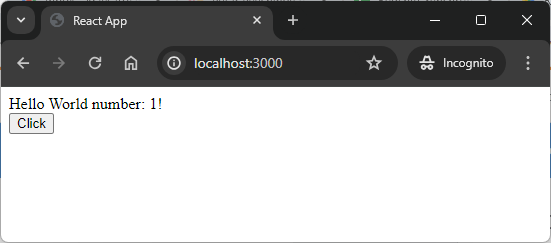

USAGE COMMANDS
--------------

> Please be aware that following tools should be installed in advance on your computer: **node.js**. 

> Please **clone/download** project, open **project's main folder** in your favorite **command line tool** and then **proceed with steps below**. 

Usage steps:
1. (Optional) In a command line create react application with `npx create-react-app js-react-gui-html-helloworld-hook-usememo`
1. In a command line tool install nmp packages with `npm install`
1. In a command line tool start application with `npm start`
1. In a http browser (e.g. Chrome) visit `http://localhost:3000`
   * Expected **Hello World number: {number}** message (after pressing button **Click** number should increase)
1. Clean up environment 
     * In a command line tool stop application with `ctrl + C`

USAGE IMAGES
------------

DESCRIPTION
-----------

##### Goal
The goal of this project is to present how to use a **hook** type **useMemo** in an application type **GUI HTML** based on **JavaScript** programming language with usage **react** framework.

##### Terminology
Terminology explanation:
* **Hook**: React Hooks are inbuilt functions provided by React that allow functional components to use state and lifecycle features.
* **useMemo**: the useMemo hook is a performance optimization function that memorizes the result of a computation. In other words it should be used for heavy functions which are not changed very often. These functions are done once and results are memorized and used during rerendering of Components.
* **JavaScript**: is a scripting or programming language that allows you to implement complex features on web pages or to implement web applications.
* **GUI HTML**: it's an abbreviation for Graphical User Interface. It enables user to interact with application. GUI HTML means that user interacts with application via html web pag.
* **React framework**: It’s used for building interactive user interfaces and web applications quickly and efficiently with significantly less code than you would with vanilla JavaScript.

##### Flow
The following flow takes place in this project:
1. User via any html browser sends request to application for the content.
1. Application sends back response to user via html browser with message

##### Launch
To launch this application please make sure that the **Preconditions** are met and then follow instructions from **Usage** section.

##### Technologies
This project uses following technologies:
* **JavaScript**: `https://docs.google.com/document/d/1wtk8TTIDLsHSvtyUp7uCk-pOKTpmNwMANRGmBNaoBpc/edit?usp=sharing`
* **Node** (section 'Node'): `https://docs.google.com/document/d/1wtk8TTIDLsHSvtyUp7uCk-pOKTpmNwMANRGmBNaoBpc/edit?usp=sharing`
* **React framework** (section 'React Framework'): `https://docs.google.com/document/d/1wtk8TTIDLsHSvtyUp7uCk-pOKTpmNwMANRGmBNaoBpc/edit?usp=sharing`

PRECONDITIONS
-------------

##### Preconditions - Tools
* Installed **Operating System** (tested on Windows 11)
* Installed **Node** (tested on version 18.18.1)

##### Preconditions - Actions
* Download **Source Code** (using Git or in any other way) 
* Open any **Command Line** tool (for instance "Windonw PowerShell" on Windows OS) on downloaded **project's main folder**