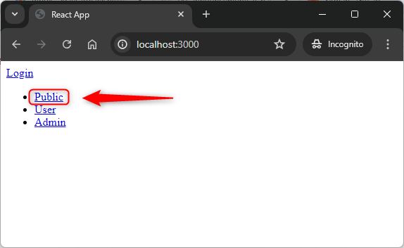

USAGE COMMANDS
--------------

> Please be aware that following tools should be installed on your local PC: **Java**, **Maven**, **node.js** and **Git**. 

> Please **clone/download** project, open **project's main folder** in your favorite **command line tool** and then **proceed with steps below**. 

Usage steps:
1. In a first command line tool start api application with `cd .\react-springboot-helloworld-api\ | mvn spring-boot:run`
1. In a second command line tool install ui application with `cd .\react-springboot-helloworld-ui\ | npm install`
1. In a second command line tool start ui application with `cd .\react-springboot-helloworld-ui\ | npm start`
1. In a browser visit `http://localhost:3000`
   * Credentials for USER role (access for User resources): **user / user123**
   * Credentials for ADMIN role (access for User and Admin resources): **admin / admin123**
1. Clean up environment 
     * In a command line tool stop application with `ctrl + C`

USAGE PICTURES
--------------

DESCRIPTION
-----------

##### Goal
The goal of this project is to present how to secure connection by **OAuth2** and **JWT Token** between **front-end** application - basing on **React** framework - with **back-end** application - basing on **Java and Spring Boot** framework. Connection is done by using **API REST**. 

##### Terminology
Terminology explanation:
* **Java**: object-oriented programming language
* **API REST**: an architectural style for an application program interface (API) that uses HTTP requests to access and use data
* **Spring Boot**: framework for Java. It consists of: Spring + Container + Configuration
* **Maven**: tool for build automation
* **Git**: tool for distributed version control
* **React framework**: It’s used for building interactive user interfaces and web applications quickly and efficiently with significantly less code than you would with vanilla JavaScript.
* **Security**: in IT it means authentication + authorization. Authentication - application confirms that you are you and checks your role. Authorization - application confirms that you have access to requested resources.
* **OAuth2**: OAuth2 (Open Authorization 2.0) is an authorization framework that enables applications to obtain limited access to user accounts on an HTTP service.
* **JWT**: JSON Web Token (JWT) is an open standard (RFC 7519) for securely transmitting information between parties as a JSON object. This information can be verified and trusted because it is digitally signed.
* **JavaScript**: is a scripting or programming language that allows you to implement complex features on web pages or to implement web applications.
* **GUI HTML**: it's an abbreviation for Graphical User Interface. It enables user to interact with application. GUI HTML means that user interacts with application via html web pag.
* **React framework**: It’s used for building interactive user interfaces and web applications quickly and efficiently with significantly less code than you would with vanilla JavaScript.

##### Launch
To launch this application please make sure that the **Preconditions** are met and then follow instructions from **Usage** section.

PRECONDITIONS
-------------

##### Preconditions - Tools
* Installed **Operating System** (tested on Windows 11)
* Installed **Java** (tested on version 21.0.2)
* Installed **Maven** (tested on version 3.8.5)
* Installed **Git** (tested on version 2.33.0.windows.2)
* Installed **NPM** (tested on version 10.2.4)

##### Preconditions - Actions
* Download **Source Code** (using Git or in any other way) 
* Open any **Command Line** tool (for instance "Windonw PowerShell" on Windows OS) on downloaded **project's main folder**