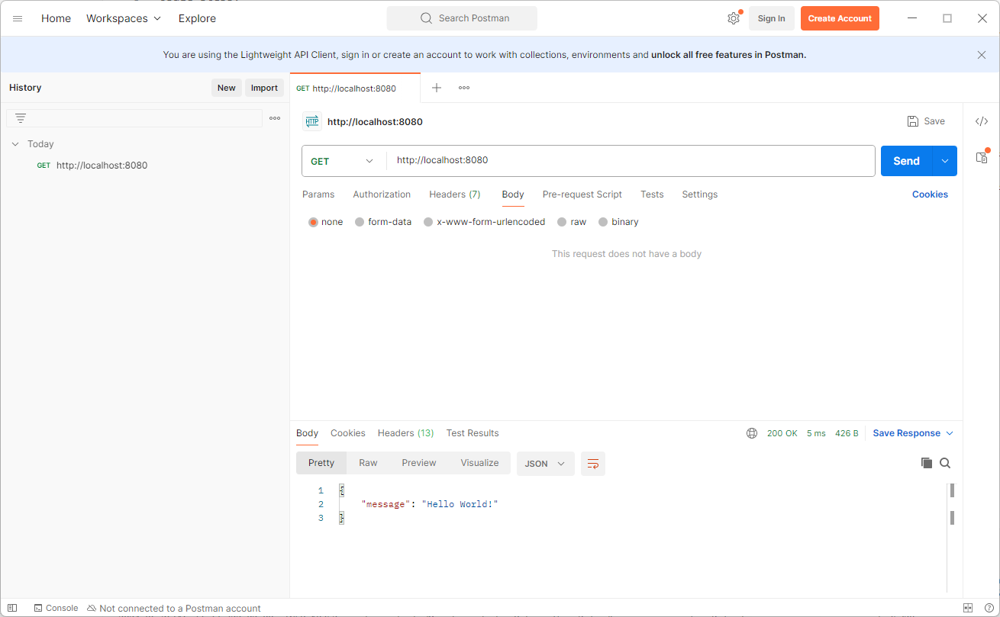
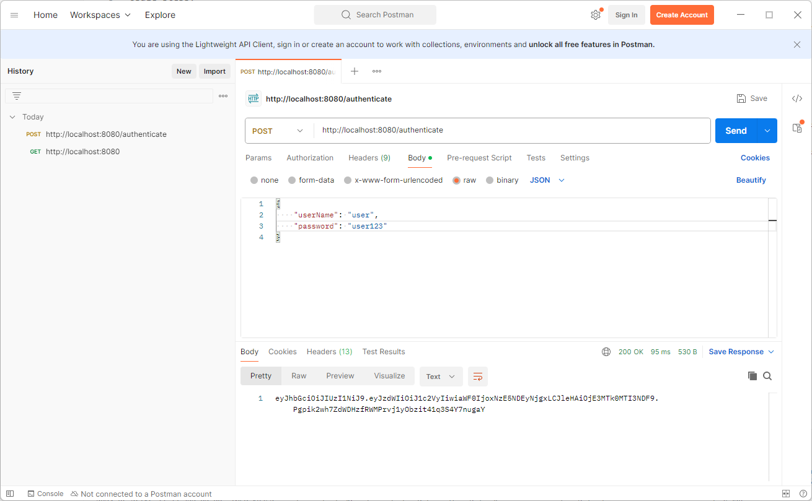
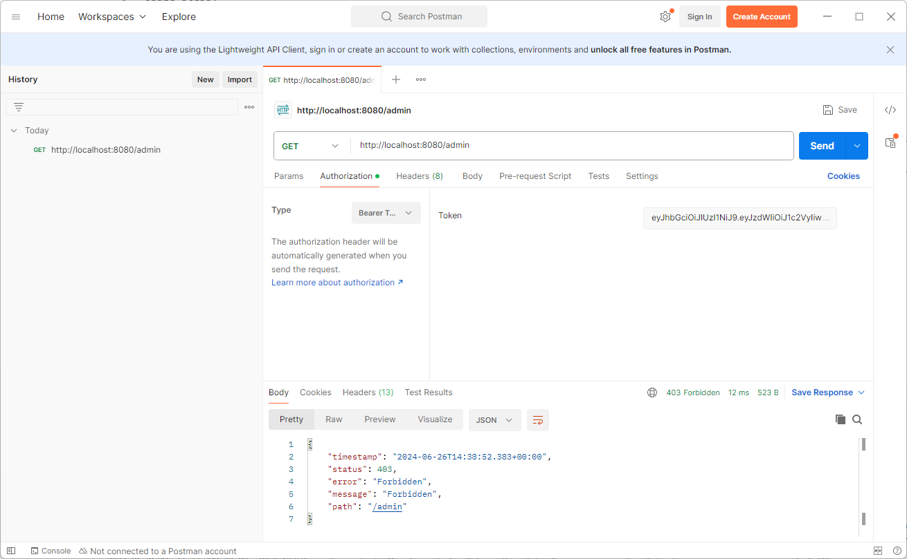
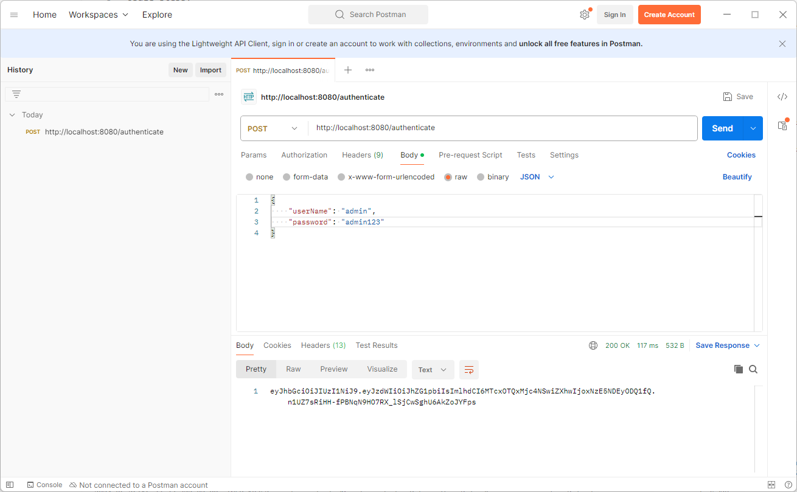
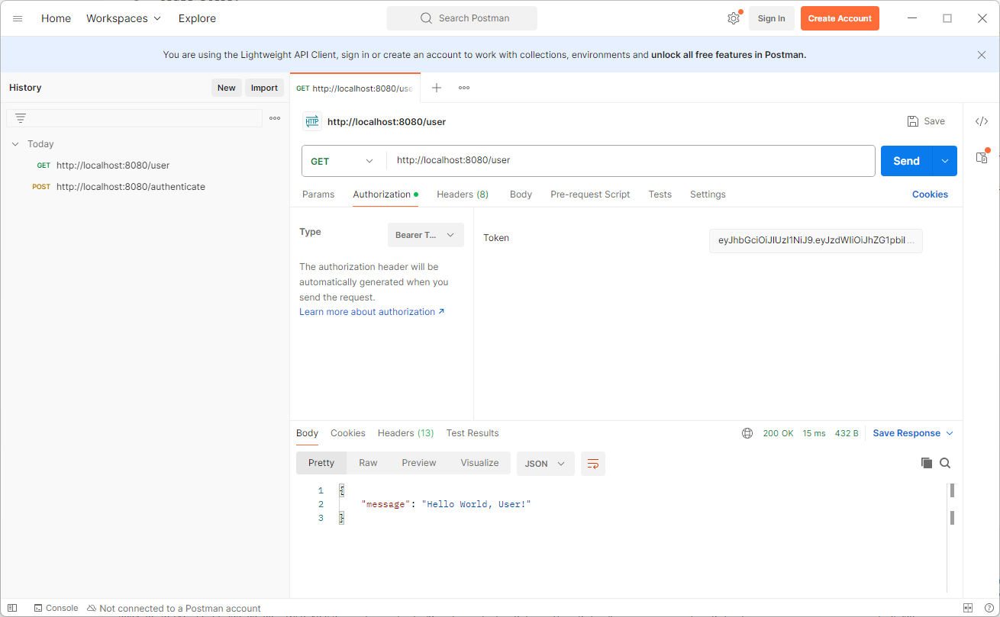
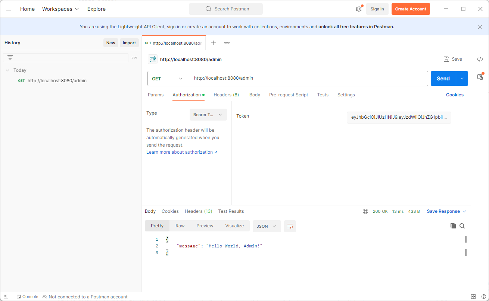

USAGE COMMANDS
--------------

> Please be aware that following tools should be installed in advance on your computer: **Java**, **Maven** and **Git**. 

> Please **clone/download** project, open **project's main folder** in your favorite **command line tool** and then **proceed with steps below**. 

Usage steps:
1. Start application with `mvn spring-boot:run`
1. In any REST Client (e.g. Postman) display Public resources using GET method with `http://localhost:8080`
1. In any REST Client (e.g. Postman) authenticate using POST method with JSON body with `http://localhost:8080/authenticate`
   * Credentials for USER role (access for User resources): **{"userName": "user", "password": "user123"}**
   * Credentials for ADMIN role (access for User and Admin resources): **{"userName": "admin", "password": "admin123"}**
   * A a result expected **JWT Token**
1. In any REST Client (e.g. Postman) display User resources using GET method with authorization **Bearer Token** with `http://localhost:8080/user`
1. In any REST Client (e.g. Postman) display Admin resources using GET method with authorization **Bearer Token** with `http://localhost:8080/admin`
1. Clean up environment:
    * Stop application with `ctrl + C`

USAGE IMAGES
------------

DESCRIPTION
-----------

##### Goal
The goal of this project is to present how to implement **security** type **OAuth2** with token **JWT** for **API** application type **REST** in **Java** programming language with usage **Spring Boot** framework and **Spring Security** dependencies. Users are stored **in memory** of application.

##### Terminology
Terminology explanation:
* **Security**: in IT it means authentication + authorization. Authentication - application confirms that you are you and checks your role. Authorization - application confirms that you have access to requested resources.
* **OAuth2**: OAuth2 (Open Authorization 2.0) is an authorization framework that enables applications to obtain limited access to user accounts on an HTTP service.
* **JWT**: JSON Web Token (JWT) is an open standard (RFC 7519) for securely transmitting information between parties as a JSON object. This information can be verified and trusted because it is digitally signed.
* **API**: An API (Application Programming Interface) is a set of rules and protocols for building and interacting with software applications. It defines the methods and data structures that developers can use to interact with the software component, system, or service.
* **REST**: REST (Representational State Transfer) is an architectural style for designing networked applications. It relies on a stateless, client-server communication protocol, typically HTTP.
* **Java**: object-oriented programming language.
* **Spring Boot**: framework for Java. It consists of: Spring + Container + Configuration.
* **Thymeleaf**: Thymeleaf is a modern server-side Java template engine for web and standalone environments. It is used for processing and generating HTML, XML, JavaScript, CSS, and plain text. Thymeleaf's main goal is to bring elegant natural templates to your development workflow.
* **Spring Security**: Spring Security is a powerful and highly customizable authentication and access-control framework for the Java application development environment. It is part of the Spring Framework ecosystem and provides comprehensive security services for enterprise applications.
* **In memory**: it means that credentials and roles are stored in memory of application.

##### Launch
To launch this application please make sure that the **Preconditions** are met and then follow instructions from **Usage** section.

PRECONDITIONS
-------------

##### Preconditions - Tools
* Installed **Operating System** (tested on Windows 10)
* Installed **Java** (tested on version 11.0.16.1)
* Installed **Maven** (tested on version 3.8.5)
* Installed **Git** (tested on version 2.33.0.windows.2)

##### Preconditions - Actions
* **Download** source code using Git 
* Open any **Command Line** (for instance "Windonw PowerShell" on Windows OS) tool on **project's folder**.