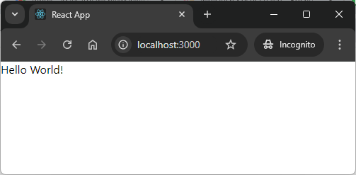

USAGE COMMANDS
--------------

> Please be aware that following tools should be installed in advance on your computer: **node.js**. 

> Please **clone/download** project, open **project's main folder** in your favorite **command line tool** and then **proceed with steps below**. 

Usage steps:
1. (Optional) In a command line create react application with `npx create-react-app js-react-gui-html-helloworld-server`
1. In a command line tool install nmp packages with `npm install`
1. In a command line tool start application in development mode with `npm start`
1. In a http browser (e.g. Chrome) visit `http://localhost:3000`
   * Expected message **Hello World from Development!**
   * Expected console log **You are running in development mode.**
1. In a command line tool stop application with `ctrl + C`
1. In a command line tool build production application with `npm run build`
1. In a command line tool start application in production mode with `node server.js`
1. In a http browser (e.g. Chrome) visit `http://localhost:3000`
   * Expected message **Hello World from Production!**
   * Expected console log **You are running in production mode.**
1. In a command line tool stop application with `ctrl + C`

USAGE IMAGES
------------

DESCRIPTION
-----------

##### Goal
The goal of this project is to present how to work with dev and prod **environments** in an application type **GUI HTML** based on **JavaScript** programming language with usage **react** framework.

##### Terminology
Terminology explanation:
* **Environments**: usually application is deployed on at least two environments: dev and prod. Dev (Development) environment is used for development process. Prod (Production) environment is used to provide final product to the users. 
* **JavaScript**: is a scripting or programming language that allows you to implement complex features on web pages or to implement web applications.
* **GUI HTML**: it's an abbreviation for Graphical User Interface. It enables user to interact with application. GUI HTML means that user interacts with application via html web pag.
* **React framework**: It’s used for building interactive user interfaces and web applications quickly and efficiently with significantly less code than you would with vanilla JavaScript.

##### Launch
To launch this application please make sure that the **Preconditions** are met and then follow instructions from **Usage** section.

PRECONDITIONS
-------------

##### Preconditions - Tools
* Installed **Operating System** (tested on Windows 11)
* Installed **Node** (tested on version 18.18.1)

##### Preconditions - Actions
* Download **Source Code** (using Git or in any other way) 
* Open any **Command Line** tool (for instance "Windonw PowerShell" on Windows OS) on downloaded **project's main folder**