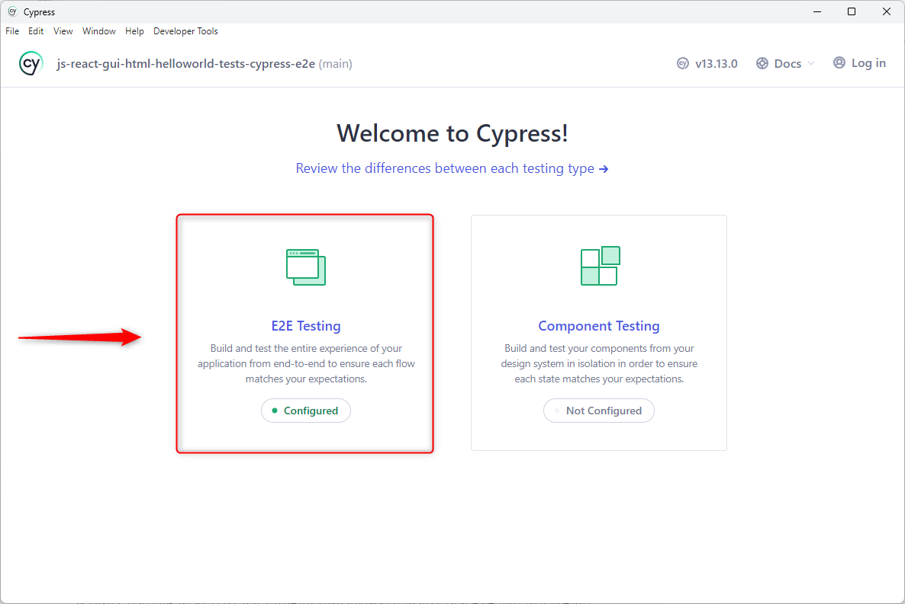
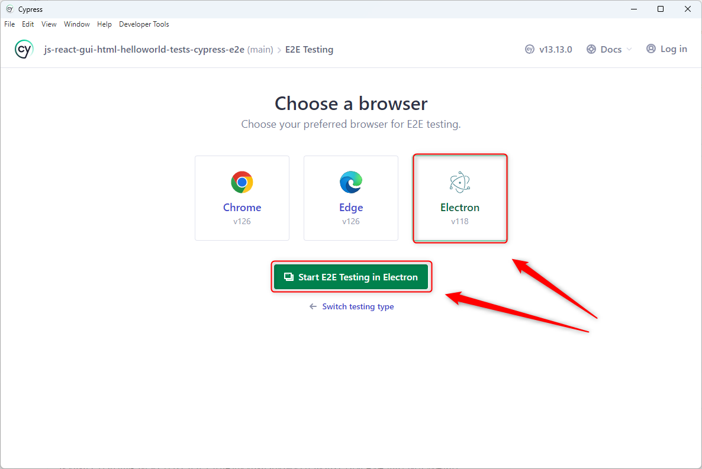
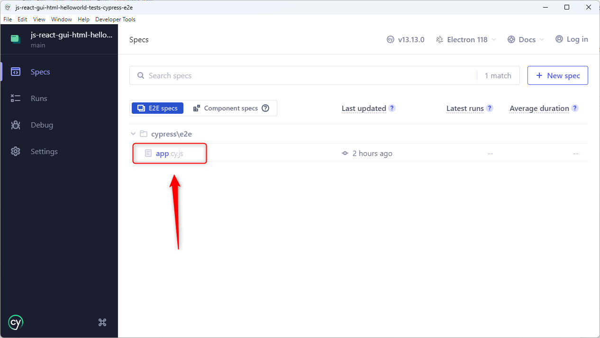
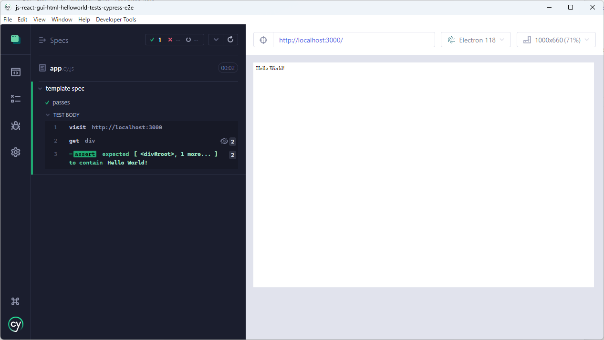
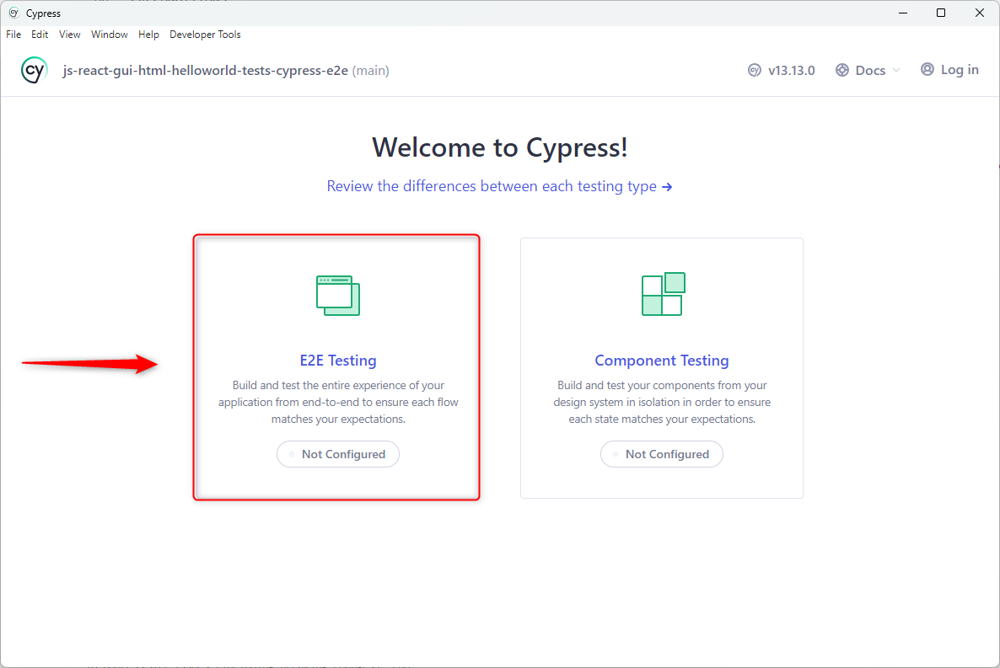
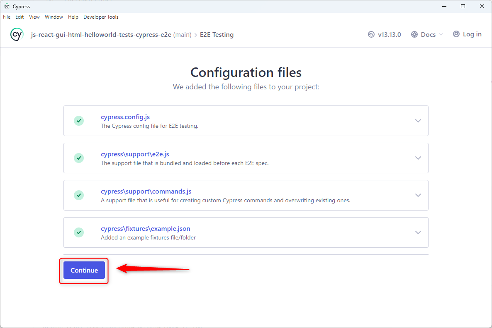
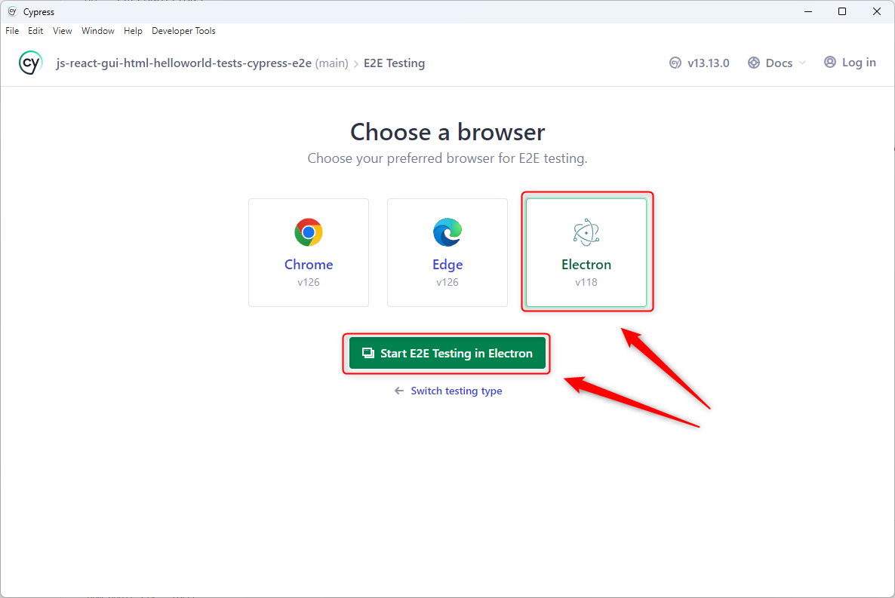
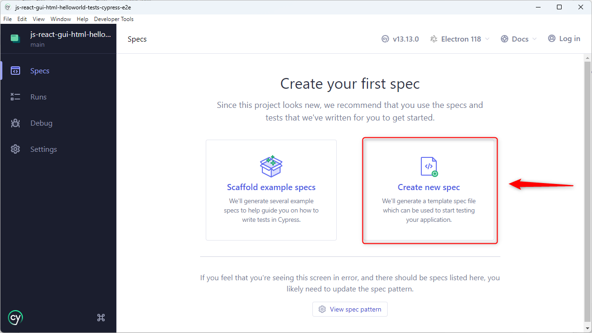
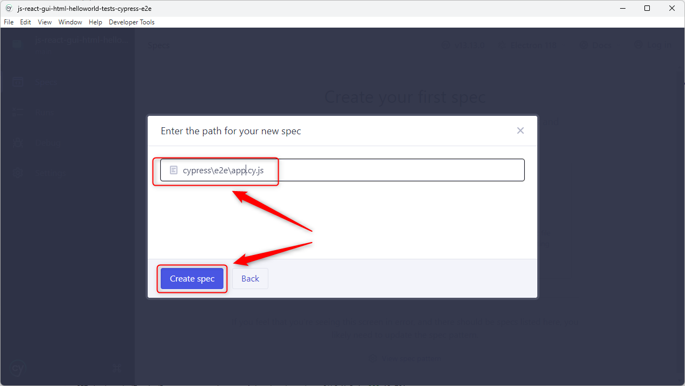
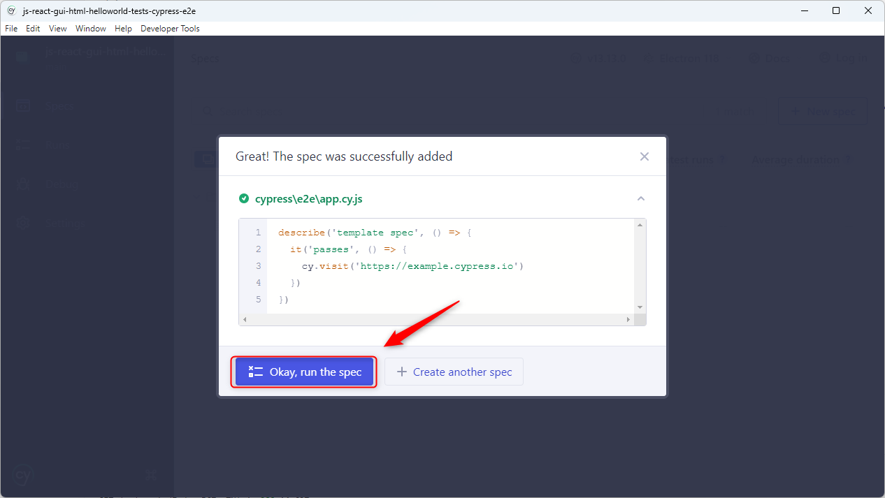

USAGE COMMANDS
--------------

> Please be aware that following tools should be installed in advance on your computer: **node.js**. 

> Please **clone/download** project, open **project's main folder** in your favorite **command line tool** and then **proceed with steps below**. 

Usage steps:
1. (Optional) In a command line create react application with `npx create-react-app js-react-gui-html-helloworld-tests-cypress-e2e`
1. In a command line tool install nmp packages with `npm install`
1. (Optional) In a command line tool install cyprss with `npm install cypress --save-dev`
1. (Optional) Configure tests of component by following steps from section **Configure Cypress**
1. In a first command line tool start application with `npm start`
1. In a second command line tool open cypress with `npx cypress open`
1. Run tests of components by following steps from section **Usage Items**
1. Clean up environment 
     * Close cypress window
     * In a first command line tool stop application with `ctrl + C`

USAGE IMAGES
------------

DESCRIPTION
-----------

##### Goal
The goal of this project is to present how to create and run **tests** type **components** using **Cypress** tool an application type **GUI HTML** in **JavaScript** programming language with usage **react** framework.

##### Terminology
Terminology explanation:
* **Testing components**: comparing component's expectations with real results;
* **Cypress**: Cypress is a modern end-to-end testing framework designed for web applications. It is built to address the key pain points developers and QA engineers face when testing modern web applications.
* **JavaScript**: is a scripting or programming language that allows you to implement complex features on web pages or to implement web applications.
* **GUI HTML**: it's an abbreviation for Graphical User Interface. It enables user to interact with application. GUI HTML means that user interacts with application via html web pag.
* **React framework**: It’s used for building interactive user interfaces and web applications quickly and efficiently with significantly less code than you would with vanilla JavaScript.

##### Flow
The following flow takes place in this project:
1. User via any html browser sends request to application for the content.
1. Application sends back response to user via html browser with message

##### Launch
To launch this application please make sure that the **Preconditions** are met and then follow instructions from **Usage** section.

##### Technologies
This project uses following technologies:
* **JavaScript**: `https://docs.google.com/document/d/1wtk8TTIDLsHSvtyUp7uCk-pOKTpmNwMANRGmBNaoBpc/edit?usp=sharing`
* **Node** (section 'Node'): `https://docs.google.com/document/d/1wtk8TTIDLsHSvtyUp7uCk-pOKTpmNwMANRGmBNaoBpc/edit?usp=sharing`
* **React framework** (section 'React Framework'): `https://docs.google.com/document/d/1wtk8TTIDLsHSvtyUp7uCk-pOKTpmNwMANRGmBNaoBpc/edit?usp=sharing`

PRECONDITIONS
-------------

##### Preconditions - Tools
* Installed **Operating System** (tested on Windows 11)
* Installed **Node** (tested on version 18.18.1)

##### Preconditions - Actions
* Download **Source Code** (using Git or in any other way) 
* Open any **Command Line** tool (for instance "Windonw PowerShell" on Windows OS) on downloaded **project's main folder**

CONFIGURE CYPRESS
-----------------

In a command line tool open cypress with `npx cypress open`

